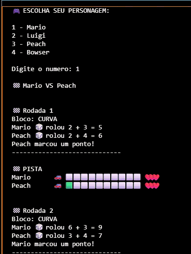

# 🏁 Mario Kart Simulator - Node.js

<div align="center">
  
</div>

## 📖 Sobre o Projeto

Este projeto foi desenvolvido como desafio da formação de Node.js da DIO, inspirado no universo Mario Kart.

O objetivo é simular uma corrida diretamente no terminal utilizando JavaScript e Node.js, aplicando conceitos de lógica de programação, modularização, manipulação de objetos, funções assíncronas e organização de código.

Além das funcionalidades propostas no desafio original, foram implementadas mecânicas extras para tornar a experiência mais divertida e próxima dos jogos da franquia Mario Kart.

---

## 🚀 Funcionalidades

<div align="center">
  
</div>

### 🎮 Escolha de Personagem

O jogador pode selecionar seu personagem antes da corrida.

Personagens disponíveis:

* Mario
* Luigi
* Peach
* Bowser

Cada personagem possui atributos únicos:

* Velocidade
* Manobrabilidade
* Poder
* Vida

---

## 🏎️ Sistema de Corrida

A corrida acontece em 5 rodadas.

Em cada rodada é sorteado aleatoriamente um tipo de bloco:

### 🛣️ RETA

* Os jogadores rolam um dado de 6 lados.
* O resultado é somado ao atributo de Velocidade.
* Quem obtiver o maior valor ganha 1 ponto.

### ↩️ CURVA

* Os jogadores rolam um dado de 6 lados.
* O resultado é somado ao atributo de Manobrabilidade.
* Quem obtiver o maior valor ganha 1 ponto.

### 🥊 CONFRONTO

* Os jogadores rolam um dado de 6 lados.
* O resultado é somado ao atributo de Poder.
* O vencedor do confronto pode causar dano ao adversário utilizando um item aleatório.

---

## 🎁 Sistema de Itens

Durante os confrontos, um item é sorteado aleatoriamente.

### 🐢 Casco

* Causa 1 ponto de dano.

### 💣 Bomba

* Causa 2 pontos de dano.

---

## ❤️ Sistema de Vida

Todos os personagens iniciam a corrida com:

❤️❤️❤️ (3 vidas)

Ao receber dano:

* Casco → -1 vida
* Bomba → -2 vidas

Quando a vida chega a 0:

* O personagem é eliminado.
* A corrida termina imediatamente.

---

## ⚡ Sistema de Turbo

Após vencer um confronto, existe uma chance de receber um Turbo.

Benefício:

* +1 ponto adicional na corrida.

---

## 📊 Barra de Progresso

Durante a corrida, uma barra visual mostra:

* Pontuação atual
* Progresso na pista
* Quantidade de vidas restantes

Exemplo:

Mario      🚗 🟩🟩🟩⬜⬜⬜⬜⬜⬜⬜ ❤️❤️❤️

Bowser     🚗 🟩🟩⬜⬜⬜⬜⬜⬜⬜⬜ ❤️❤️

---

## 📂 Estrutura do Projeto

```bash
src/
│
├── cli/
│   └── menu.js
│
├── data/
│   ├── characters.js
│   └── items.js
│
├── services/
│   ├── itemService.js
│   └── raceEngine.js
│
├── utils/
│   ├── dice.js
│   ├── log.js
│   ├── raceBar.js
│   └── random.js
│
└── index.js
```

## 🛠️ Tecnologias Utilizadas

* Node.js
* JavaScript (ES6+)
* Modularização com CommonJS
* Terminal/CLI

---

## ▶️ Como Executar

Clone o repositório:

```bash
git clone git@github.com:MilenaMP/Projeto-mario-kart.git
```

Acesse a pasta:

```bash
cd mario-kart-simulator
```

Instale as dependências:

```bash
npm install
```

Execute o projeto:

```bash
npm start
```

---

## 📚 Conceitos Praticados

* Estruturas de dados
* Objetos JavaScript
* Funções assíncronas
* Modularização
* Manipulação de arrays
* Geração de números aleatórios
* Organização de projetos Node.js
* Simulação de eventos
* Lógica de jogos

---

## 🏆 Melhorias Implementadas

Além do desafio original, foram adicionadas:

✅ Escolha de personagem

✅ Sistema de vida

✅ Sistema de itens

✅ Sistema de turbo

✅ Eliminação por dano

✅ Barra visual da corrida

✅ Modularização do código

---

Desenvolvido durante a formação Node.js da DIO 🚀
